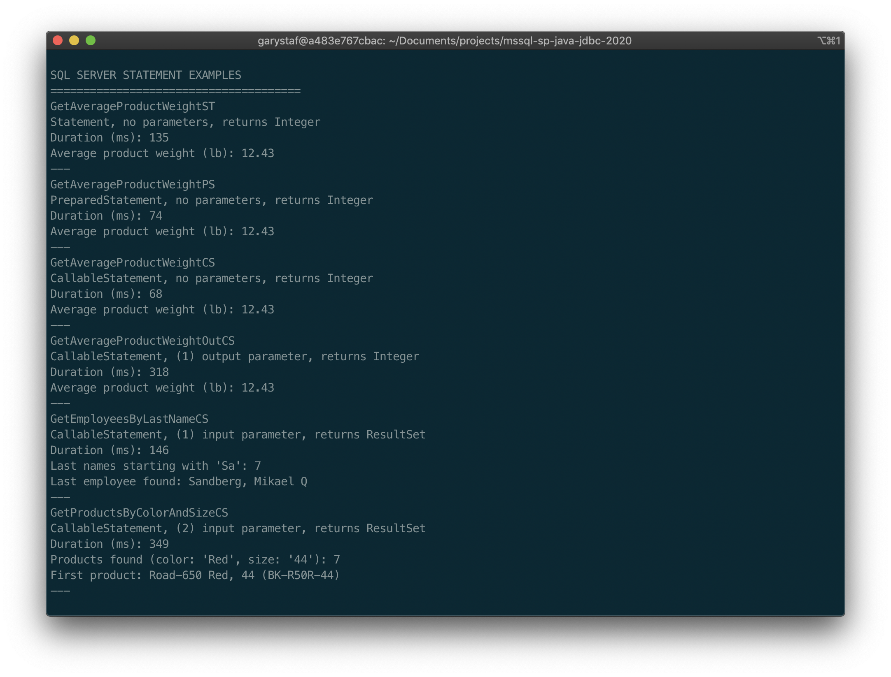

# Calling Microsoft SQL Server Stored Procedures from a Java Application Using JDBC (2020 Edition)

## Demonstrate the use of the JDBC to call stored procedures from a Microsoft SQL Server database and return data to a Java-based console application.

An update of the original blog post, [Calling Microsoft SQL Server Stored Procedures from a Java Application Using JDBC](https://programmaticponderings.com/2012/08/24/calling-sql-server-stored-procedures-with-java-using-jdbc/), and GitHub project files, [mssql-sp-java-jdbc](https://github.com/garystafford/mssql-sp-java-jdbc), published August 24, 2012.

## Major Changes to Project

1. __Microsoft SQL Server__: Was based on SQL Server 2008 R2 (10.50.1600.1), now SQL Server 2017 (14.00.3281.6.v1);
2. __JDBC Driver__: Was built with Microsoft JDBC Driver 4.0 for SQL Server (JDBC 4.0 for JRE 6), now Microsoft JDBC Driver 8.4 for SQL Server (JDBC Driver 8.4 for JRE 11);
3. __Database__: Was based on AdventureWorks2008R2, now AdventureWorks2017 (OLTP) full database;
4. __Java__: Was built with Java SE Development Kit (JDK) 6, now Java SE Development Kit (JDK) 13;
5. __IDE__: Was built with Netbeans 7.1.2, now IntelliJ IDEA 2020.2 (Ultimate Edition);
6. __Build Automation Tool__: Was built with Apache Ant, now Gradle 6.6.1;

## Scripts

* `RestoreAdventureWorksBackUp.sql`: Example of running full restore of AdventureWorks backup and check progress
* `RunStoredProcedures.sql`: Run all stored procedures, after they are installed.
* `ClearCache.sql`: Running DBCC `FREESYSTEMCACHE` clears the plan cache

## Commands

```bash
./gradlew clean
./gradlew build
./gradlew cleanTest test
./gradlew run --warning-mode none
```

## Preview



## References

* [Amazon RDS for SQL Server](https://aws.amazon.com/rds/sqlserver/)
* [Importing and Exporting SQL Server Databases](https://docs.aws.amazon.com/AmazonRDS/latest/UserGuide/SQLServer.Procedural.Importing.html)
* [AdventureWorks sample databases](https://github.com/Microsoft/sql-server-samples/releases/tag/adventureworks)
